# 数组 `Array`

| 数据结构 :speech_balloon: | 年代 :speech_balloon: | 难度 :speech_balloon: | 实用性 :speech_balloon: | 重要度 :speech_balloon: | 友好度 :speech_balloon: | 性能 :speech_balloon: | 有序性 :speech_balloon: | 安全性 :speech_balloon: |
| :---------------------------: | :----------------------: | :----------------------: | :------------------------: | :------------------------: | :------------------------: | :----------------------: | :------------------------: | :----: |
|             数组              |           原始           |          :star:          |            :star::star::star::star:            | :star::star::star::star::star: |        :star::star:        | :star::star::star: |     :white_check_mark:     |  :x:   |

## 概述

数组，一种原始的数据结构，有序的元素序列。 数组适用于将很多个相同类型的数据存在一起，构建一个相同数据的集合。存储在数组中的数据类型，是根据声明时的类型而定的。数组中的数据称作元素，数组中数据的位置称作索引或下标。

数组可以是多维的，一般简单的是一维数组。二维数组就是在数组中存储数组，还可以有三维以上，太多纬度会导致数组运算复杂，不推荐应用。应考虑其他的数据结构模型。

Java的数组是由原始底层提供，其底层提供的方法有构建数组、数组长度、设置数据、获取指定索引位置元素数据、包括克隆数组等最常用最基本的API方法接口。

## 用途

可以有序的存储任何数据类型的数据结构，在简单的数据集合的选择上，数组是一个非常适合的选择。数组也是其他很多数据结构模型的基础模型，其他数据模型的构建都是通过在数组的基础上进行封装演变而来的成果。

## 特点

+ 数组可以存放原始数据类型或其他自定义对象数据类型
+ 数组存储的元素都是有序的，按照存入的顺序先后存放，是按照索引固定位置
+ 可以插入重复的数据
+ 数组长度是不可变
+ 下标（索引）从0开始
+ 插入速度快
+ 获取数据快
+ 支持通过元素遍历`forEach`和索引遍历`for`
+ 数组存在上界和下界，超过区间会抛出数组索引越界异常（`IndexOutOfBoundsException`）

## 优点与缺点

+ **优点**
  + 高效，插入、查询都非常快
  + 简单，基本的操作API，没有复杂的应用
  + 扩展性强，可以扩展成复杂的数据结构模型
+ **缺点**
  + 不支持直接查找元素，需要遍历

## 数据结构

+ 数组声明后的内存结构

  

+ 在下标 `2` 的位置上设置元素值

  

## 性能分析

+ **插入**数组插入速度直接通过索引定位，**时间复杂度**：`O(1)`
+ **定位**数组获取某个元素，直接通过索引定位，**时间复杂度**：`O(1)`
+ **查找**数组查找元素，需要遍历全部元素，**时间复杂度**：`O(n)`
+ **移除**直接通过索引定位，然后设置默认空值，**时间复杂度**：`O(1)`

## 安全分析

原始数据结构，多线程下数据共享是不安全的。会存在多线程竞争同一个索引下标位置的元素修改权，导致指向内存地址错误的可能性。特别是在修改或者删除数据的情况下，多线程很容易出现问题。

若将一个数组，分成不同等份，再由多个线程去操作不同部分，这样不失为一个好的解决方案。实际中的使用案例有，多线程下载或上传文件，使用数组保存下载或上传文件数据的不同部分信息。

## 代码实现

### 数组的简单应用

+ 图解

+ 数组简单应用，实现代码：[ArrayModel.java](./java/io/github/hooj0/arrays/_01_basic_array/ArrayModel.java)

### 简单自定义数组封装

+ 图解

  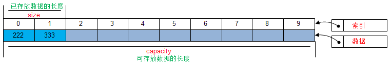

+ 封装数组，实现代码：[CustomArray.java](./java/io/github/hooj0/arrays/_02_custom_array/CustomArray.java)

### 添加元素的自定义数组

+ 图解：在首部添加元素

  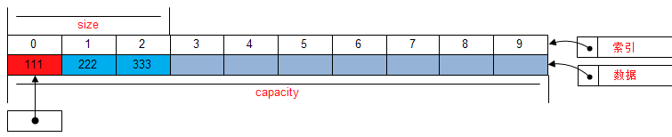

+ 图解：在尾部添加元素

  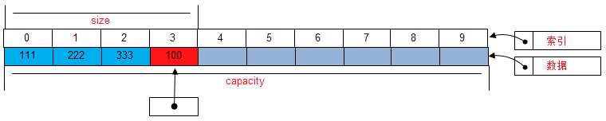

+ 图解：在中间位置插入元素

  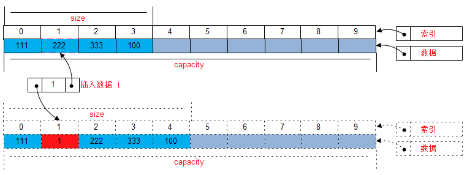

+ 实现代码：[CustomAddItemsArray.java](./java/io/github/hooj0/arrays/_03_add_elements_array/CustomAddItemsArray.java)

### 获取和设置元素的自定义数组

+ 图解：设置指定索引上的元素

  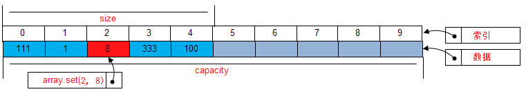

+ 图解：获取指定索引上的元素

  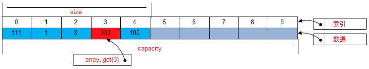

+ 实现代码：[GetterSetterItemsArray.java](./java/io/github/hooj0/arrays/_04_getter_setter_elements_array/GetterSetterItemsArray.java)

### 删除数组元素

+ 图解：删除首部元素

  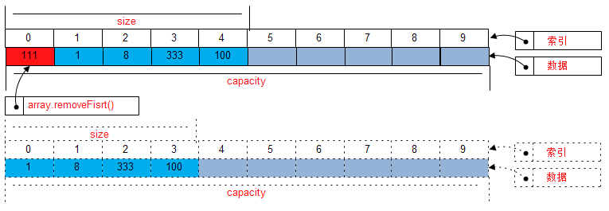

+ 图解：删除尾部元素

  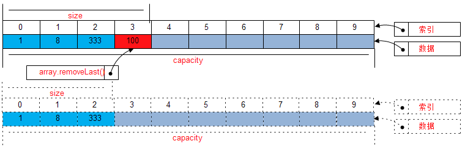

+ 图解：删除索引位置元素

  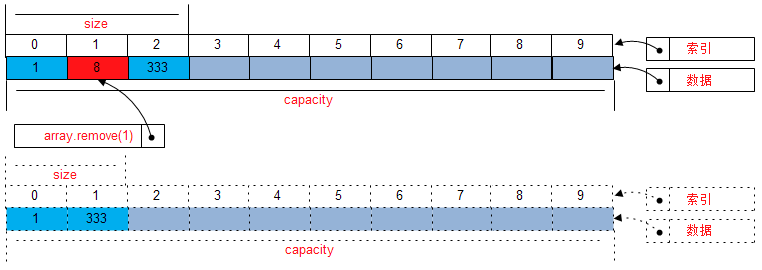

+ 实现代码：[RemoveContainsFindItemsArray.java](java/io/github/hooj0/arrays/_05_contains_find_remove_elements_array/RemoveContainsFindItemsArray.java)

### 泛型数组封装

+ 实现代码：[GenericDataStructArray.java](java/io/github/hooj0/arrays/_06_generic_data_struct_array/GenericDataStructArray.java)

### 扩充数组容量

+ 图解：当容量不够，自动扩展容量

  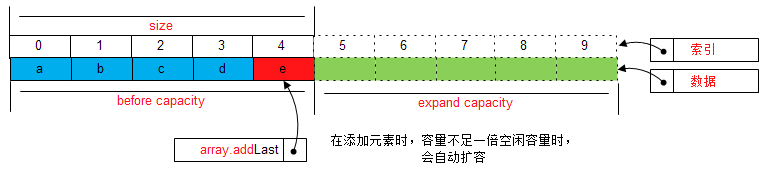

+ 图解：当容量过大，自动缩减容量

  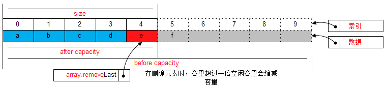

+ 实现代码：[ExpandCapacityArray.java](java/io/github/hooj0/arrays/_07_expand_capacity_array/ExpandCapacityArray.java)

## 应用场景

数组应用场景非常广泛，随处可以见到，比如Java中的`main`函数的参数就是数组。只要存在存储多个相同类型的数据集合的情况，就可以使用数组进行保存。

## 应用实例参考

### `JavaSDK`

`String` 类中的数组应用，参考：`java.lang.String.serialPersistentFields` 属性

`ArrayList` 的实现方式采用的就是数组， 参考：`java.util.Arrays.ArrayList<E>`

`Vector` 集合中的数组应用，参考：`java.util.Vector<E>`

### `GoSDK`

### `PythonSDK`

### `JavaScript Libs`

## 总结

数组功能强大，不可小瞧。应用也非常丰富，使用场景广泛，在平日里的编码中会经常使用数组，要熟练掌握数组的转换和数组的复制、移动、拼接等操作方法。

同时注意数组下标越界异常`IndexOutOfBoundsException`，应该尽量避免这类低级错误的发生。

数组在多线程场景下，避免对同一个下标位置的元素进行**写**操作，当然如果是单纯的读模式的操作，那多线程没有什么问题。

## 参考资料

+ https://github.com/kdn251/interviews

