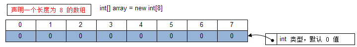
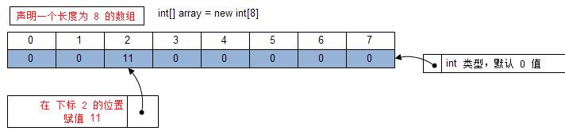
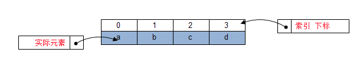

# 数组 `Array`

| 数据结构 :speech_balloon: | 年代 :speech_balloon: | 难度 :speech_balloon: | 实用性 :speech_balloon: | 重要度 :speech_balloon: | 友好度 :speech_balloon: | 性能 :speech_balloon: | 有序性 :speech_balloon: | 安全性 :speech_balloon: |
| :---------------------------: | :----------------------: | :----------------------: | :------------------------: | :------------------------: | :------------------------: | :----------------------: | :------------------------: | :----: |
|             数组              |           原始           |          :star:          |            :star::star::star::star:            | :star::star::star::star::star: |        :star::star:        | :star::star::star: |     :white_check_mark:     |  :x:   |

## 概述

数组，一种原始的数据结构，有序的元素序列。 数组适用于将很多个相同类型的数据存在一起，构建一个相同数据的集合。存储在数组中的数据类型，是根据声明时的类型而定的。数组中的数据称作元素，数组中数据的位置称作索引或下标。

数组可以是多维的，一般简单的是一维数组。二维数组就是在数组中存储数组，还可以有三维以上，太多纬度会导致数组运算复杂，不推荐应用。应考虑其他的数据结构模型。

Java的数组是由原始底层提供，其底层提供的方法有构建数组、数组长度、设置数据、获取指定索引位置元素数据、包括克隆数组等最常用最基本的API方法接口。

## 用途

可以有序的存储任何数据类型的数据结构，在简单的数据集合的选择上，数组是一个非常适合的选择。数组也是其他很多数据结构模型的基础模型，其他数据模型的构建都是通过在数组的基础上进行封装演变而来的成果。

## 特点

+ 数组可以存放原始数据类型或其他自定义对象数据类型
+ 数组存储的元素都是有序的，按照存入的顺序先后存放，是按照索引固定位置
+ 可以插入重复的数据
+ 数组长度是不可变
+ 下标（索引）从0开始
+ 插入速度快
+ 获取数据快
+ 支持通过元素遍历`forEach`和索引遍历`for`
+ 数组存在上界和下界，超过区间会抛出数组索引越界异常（`IndexOutOfBoundsException`）

## 优点与缺点

+ **优点**
  + 高效，插入、查询都非常快
  + 简单，基本的操作API，没有复杂的应用
  + 扩展性强，可以扩展成复杂的数据结构模型
+ **缺点**
  + 不支持直接查找元素，需要遍历

## 数据结构

+ 数组声明后的内存结构

  

+ 在下标 `2` 的位置上设置元素值

  

+ 全部赋值后的数据结构

## 性能分析

+ **插入**数组插入速度直接通过索引定位，**时间复杂度**：`O(1)`
+ **定位**数组获取某个元素，直接通过索引定位，**时间复杂度**：`O(1)`
+ **查找**数组查找元素，需要遍历全部元素，**时间复杂度**：`O(n)`
+ **移除**直接通过索引定位，然后设置默认空值，**时间复杂度**：`O(1)`

## 安全分析

原始数据结构，多线程下数据共享不安全。

## 代码实现

## 应用场景

## 应用实例参考

### `JavaSDK`

### `GoSDK`

### `PythonSDK`

### `JavaScript Libs`

## 总结

## 参考资料

